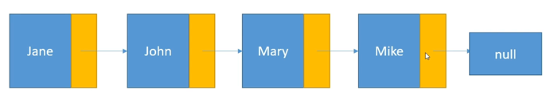
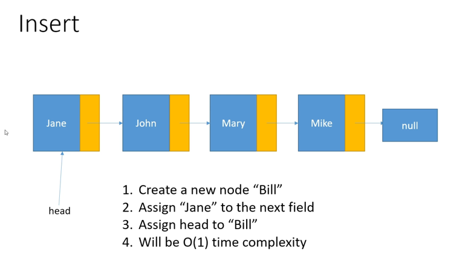
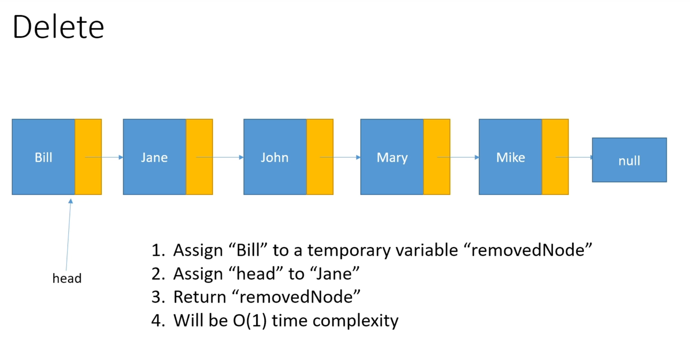

# Linked List

1. Each item in the list is called as Node
2. The First item in the list is the head f the list
3. When we have an array of integers, we just have to store the integer value in each position, but when it comes to a linked list, we have to store the integer value and we have to store a reference to the next integer in the list.

