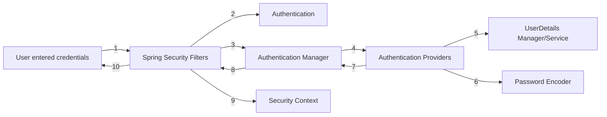

# Spring Security

- To use the spring security we use spring security dependency.
- It will give us a login ui which ask for username and password.
- The default username is `user` and password is given in the console.
- The magic is if we have given it for one time we can refresh the application it wont ask for the details again and
  again.
- It manages the session id and token behind the scene.
- It we use another browser then only it will ask for it.
- Everytime we restart the application it's going to give us new password.
- We can use our own username and password, and configure in our application

### Configure static credentials inside application properties file

- To change the username and properties we can add following properties in our application properties.\

- `spring.security.user.name = user`
- `spring.security.user.password = user`
- You can find all the properties on
  the [here](https://docs.spring.io/spring-boot/appendix/application-properties/index.html#appendix.application-properties.security)
- This will help you to define static username and passwords.

- Typical Scenario inside a web application
    - In Java web apps, Servlet Container (Web Server) takes care
      of translating the HTTP messages for Java code to
      understand. One of the mostly used servlet container is Apache
      Tomcat. Servlet Container converts the HTTP messages into
      ServletRequest and hand over to Servlet method as a parameter.
      Similarly, ServletResponse returns as an output to Servlet
      Container from Servlet. So everything we write inside Java
      web apps are driven by Servlets

- Role of Filters
    - Filters inside Java web applications can be used to intercept
      each request/response and do some pre work before our
      business logic. So using the same filters, Spring Security
      enforce security based on our configurations inside a web
      application.

